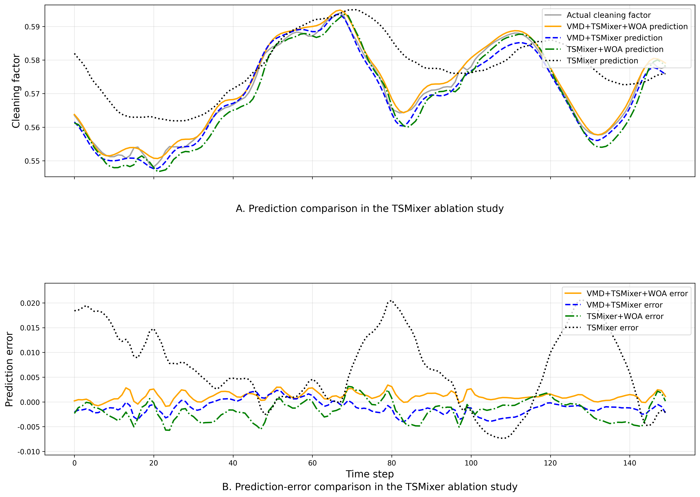
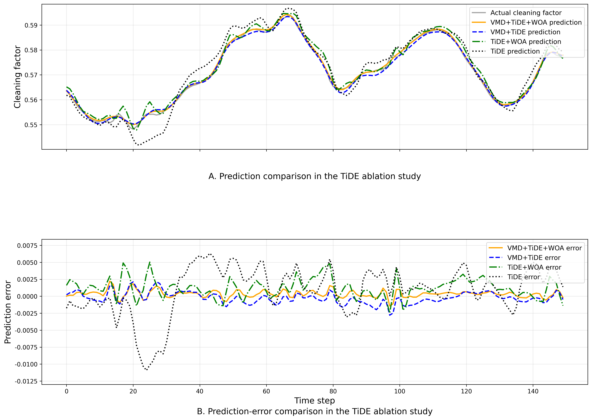
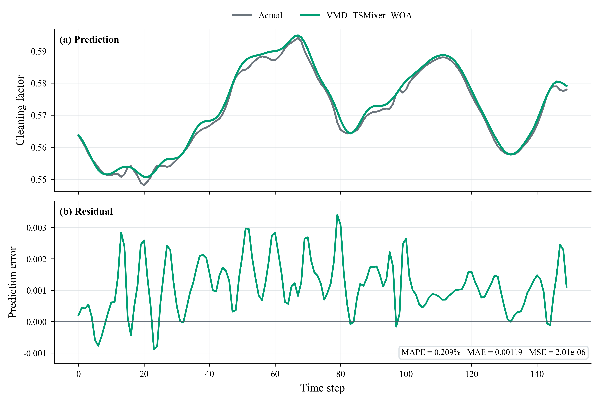
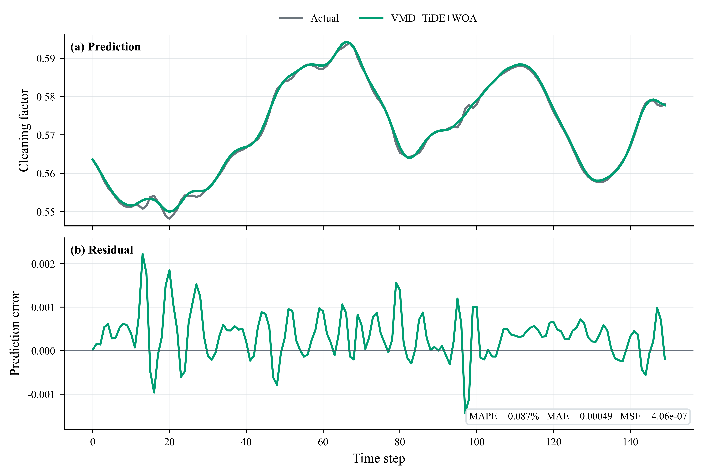

# PSBAF: Boiler Ash Fouling Prediction System

PSBAF is a graduation-design portfolio project for boiler ash fouling prediction in coal-fired power plant boilers. The project integrates signal preprocessing, Variational Mode Decomposition (VMD), neural-network time-series forecasting, Whale Optimization Algorithm (WOA)-based hyperparameter optimization, ablation experiments, and a Flask-based visualization dashboard.

The system is designed to predict the boiler cleaning factor and compare the effects of different modeling strategies, including TSMixer, TiDE, VMD-enhanced models, and WOA-optimized variants.

---

## Project Overview

Boiler ash fouling can reduce heat-transfer efficiency and affect the safe and economical operation of coal-fired power units. This project builds a prediction system for boiler ash fouling status based on historical cleaning-factor time-series data.

The main workflow includes:

1. Wavelet denoising for raw cleaning-factor signal preprocessing.
2. VMD decomposition for extracting multi-scale signal components.
3. TSMixer and TiDE models for time-series forecasting.
4. WOA-based global hyperparameter optimization.
5. Ablation experiments to evaluate the contribution of VMD and WOA.
6. Flask, AdminLTE, and Pyecharts for interactive result visualization.

---

## Key Features

* **Signal preprocessing**
  Wavelet denoising is used to reduce noise in the cleaning-factor time series.

* **Multi-scale decomposition**
  Variational Mode Decomposition is applied to decompose the original signal into several intrinsic mode components.

* **Time-series forecasting**
  TSMixer and TiDE models are used for neural-network-based prediction.

* **Global hyperparameter optimization**
  Whale Optimization Algorithm is used to search for better model hyperparameters.

* **Ablation study**
  The project compares baseline models, VMD-enhanced models, WOA-optimized models, and VMD+WOA combined models.

* **Web-based visualization dashboard**
  Flask, AdminLTE, and Pyecharts are used to build an interactive dashboard for result presentation.

---

## Repository Structure

```text
.
├── app.py                              # Flask dashboard entry point
├── Flask_app.py                        # Legacy Flask entry point
├── data_cleaning.py                    # Wavelet denoising utilities
├── data_decomposition.py               # VMD visualization script
├── data_decomposition_vmd.py           # VMD wrapper function
├── ablation_study_english.py           # English Matplotlib ablation visualization script
├── predict_*.py                        # Model training and prediction scripts
├── charts/                             # Pyecharts chart-rendering modules
├── templates/                          # Flask HTML templates
├── static/                             # Runtime static assets
├── figures/                            # Generated English figures
├── *.csv                               # Saved prediction and optimization results
├── requirements.txt                    # Python dependencies
├── .env.example                        # Example environment variables
├── .gitignore
└── README.md
```

---

## Methodology

The overall technical route is shown below:

```text
Raw cleaning-factor data
        │
        ▼
Wavelet denoising
        │
        ▼
VMD decomposition
        │
        ▼
TSMixer / TiDE forecasting models
        │
        ▼
WOA hyperparameter optimization
        │
        ▼
Prediction comparison and ablation analysis
        │
        ▼
Flask visualization dashboard
```

---

## Experimental Results

### TSMixer Ablation Study

The TSMixer ablation experiment compares the prediction performance of the following model variants:

* TSMixer
* TSMixer+WOA
* VMD+TSMixer
* VMD+TSMixer+WOA

The figure shows the prediction comparison and prediction-error comparison among these variants.



---

### TiDE Ablation Study

The TiDE ablation experiment compares the following model variants:

* TiDE
* TiDE+WOA
* VMD+TiDE
* VMD+TiDE+WOA

The comparison is used to evaluate whether VMD decomposition and WOA-based hyperparameter optimization improve the forecasting performance.



---

### VMD+TSMixer+WOA Prediction Result

This figure presents the prediction result and prediction error of the VMD+TSMixer+WOA model.



---

### VMD+TiDE+WOA Prediction Result

This figure presents the prediction result and prediction error of the VMD+TiDE+WOA model.



---

## Quick Start

### 1. Create a virtual environment

```bash
python -m venv .venv
```

Activate the environment on Windows:

```bash
.venv\Scripts\activate
```

Activate the environment on Linux or macOS:

```bash
source .venv/bin/activate
```

---

### 2. Install dependencies

```bash
pip install -r requirements.txt
```

---

### 3. Run the Flask dashboard

```bash
python app.py
```

Then open the local address shown in the terminal.

---

## Demo Accounts

| Role  | Username | Password |
| ----- | -------- | -------- |
| User  | `User`   | `User`   |
| Admin | `Admin`  | `Admin`  |

The demo accounts are only used for local portfolio demonstration.

---

## Generate English Figures

The English Matplotlib figures can be generated with:

```bash
python ablation_study_english.py --plot all --save-dir figures --no-show
```

Generate the TSMixer ablation figure only:

```bash
python ablation_study_english.py --plot tsmixer --save-dir figures --no-show
```

Generate the TiDE ablation figure only:

```bash
python ablation_study_english.py --plot tide --save-dir figures --no-show
```

Generate the VMD+TSMixer+WOA prediction figure only:

```bash
python ablation_study_english.py --plot vmd-tsmixer-woa --save-dir figures --no-show
```

Generate the VMD+TiDE+WOA prediction figure only:

```bash
python ablation_study_english.py --plot vmd-tide-woa --save-dir figures --no-show
```

---

## Data Note

The original `CF1.mat` file is not included in this GitHub-ready version by default.

If the original data is allowed to be published, place `CF1.mat` in the project root directory or modify the data path in `data_cleaning.py`.

For a public repository, it is recommended to provide only a desensitized sample dataset or a brief description of the data format.

---

## Main Workflow

### Data preprocessing

```bash
python data_cleaning.py
```

This script is used to inspect the wavelet denoising result of the cleaning-factor signal.

### VMD decomposition

```bash
python data_decomposition.py
```

This script is used to visualize the decomposed VMD components and related signal characteristics.

### Model prediction

Run the corresponding prediction scripts according to the target model:

```bash
python predict_tsmixer.py
python predict_tide.py
python predict_tsmixer_woa.py
python predict_tide_woa.py
python predict_vmd_tsmixer.py
python predict_vmd_tsmixer_woa.py
python predict_vmd_tide.py
python predict_vmd_tide_woa.py
```

The generated prediction results are saved as CSV files and can be used by the dashboard and visualization scripts.

---

## Technology Stack

* Python
* Pandas
* NumPy
* Matplotlib
* Scikit-learn
* PyWavelets
* VMD
* Darts
* TSMixer
* TiDE
* Whale Optimization Algorithm
* Flask
* AdminLTE
* Pyecharts

---

## Portfolio Highlights

This project demonstrates practical experience in:

* Industrial time-series data preprocessing
* Signal denoising and decomposition
* Neural-network forecasting model construction
* Swarm-intelligence-based hyperparameter optimization
* Ablation experiment design
* Model-performance comparison
* Flask-based web system development
* Scientific visualization and project documentation

---

## Disclaimer

This repository is prepared as a graduation-design portfolio project. The original industrial data file is not included by default. The project structure, scripts, saved result files, and generated figures are used to demonstrate the complete modeling and visualization workflow.
